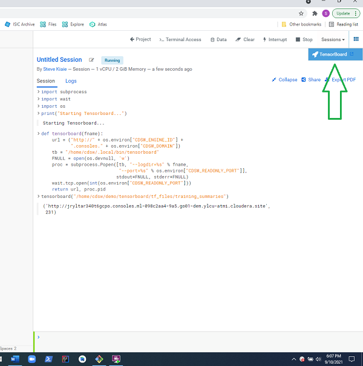

# Deep Learning In Medicine 
## Classifying Melanoma on Cloudera Machine Learning   

### Summary

In this demonstration we will build a clissifier for melanoma, using a VGG16 Convolutional Network, 
and transfer learning.  

### Excercises  

1. Take open source images of skin lesions, and use those to build a classifier to detect malignant skin lesions
2. Evaluate the performance of the model using TensorBoard, and matplotlib in CML
3. Deploy the model onto a mobile device for use in clinical settings
4. Use the mobile app to determine if a patient needs critical attention from a physician.  

In the demonstration we use a model deployed on a mobile device.  I.e. our inference 
happens on the edge, using a MobileNet model. The more likely choice for this use case would be to 
perform point inference by calling a more accurate (and compute intensive) model hosted centrally, 
or to perform classification in batch using a more accurate (and compute intensive) model.

### 1.

### 3.

### 4.

## Talk Tracks (Preliminary):

- [Deck and Demo Talk Track](https://rebrand.ly/6t1d66b)

## Deck:

- [De](https://rebrand.ly/nrdz1m)[ck](https://rebrand.ly/nrdz1m)

## Demo Setup

The setup takes 5 minutes

#### 1. 

In CML Go to Projects, and create a New Project

 

 

#### 2. 

Name the Project "Melanoma Classification", and in the initial setup use git repo: 
https://github.com/hortonworks-sk/CML-Classifying-Melanoma.git, 
and hit the create button

#### 3. 

Launch a Python 3 workbench session

#### 4. 

Navigate to the load-libraries.sh script, and run the script. This will load the libraries needed for the demo.

#### 5. 

Navigate to the start_tensorboard.py script, and run this.  

#### 6.

Check that the Tensorboard link is displaying in CML and that tensorboard is running, by clicking the tensorboard link

#### 7. 

Click on the tensorboard tabs for Scalars , Graph and the Histograms , to check that these are displaying correctly (each are shown in order below)

#### 8. 

Navigate to experiments and click run experiment

#### 9. 

Run experiments for the **_Inception3.py , and ** _VGG16.py**, scripts.  Use the python 3 kernel. No need to supply arguments for these. 

#### 10. 

When these runs have completed, you should see the experiments listed as successful in the experiments view (as in the screenshot below)

### Use Case & Industry Applicability

- Use Case:  Diagnosing Melanoma
- Broader Healthcare Applicability:
  - Disease diagnosis using medical images
    - radiology (arteriography, mammography, radiomics)
    - dermatology
    - oncology

- Broader Industry applicability
  - Biotech
  - Pharma
  
